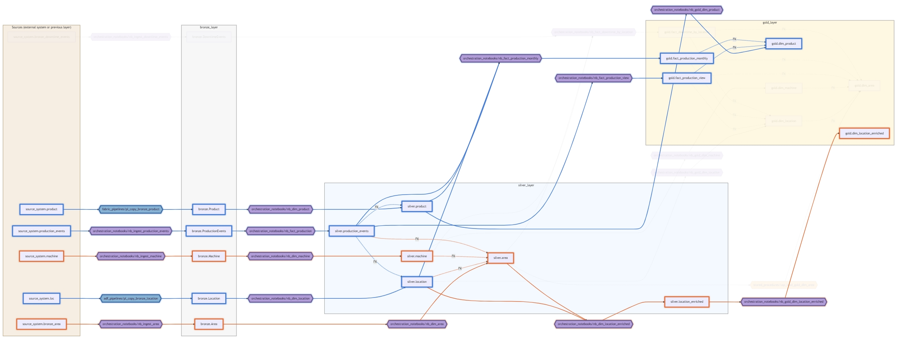

# AI-assisted data architecture and visualization

A data architecture described as code in one place — readable by a human, safe for an AI agent to maintain.

- **One source of truth: plain `.dbml` code.** Every diagram, SQL export and preview is generated from it, never kept in sync by hand.
- **Human-friendly both ways.** Edit the text directly in your editor, or view it as an ERD or an interactive lineage diagram.
- **Built for an agent to maintain.** DBML is compact text an LLM reads well, and [AGENTS.md](AGENTS.md) sets the guardrails it works under.

## Decision

The data model is described **in the `dbml/` folder**, as plain DBML code — no markdown wrapper, no parallel SQL file that a human or an agent would have to keep in sync by hand. `dbml/schema.dbml` is the model's single source of truth — one file for as long as it stays a manageable size, but every script also supports splitting it across several files in the same folder (see Tools below).

- **Visual/low-code editing** (renaming a table along with its references, changing a relation's cardinality by clicking, colors): [dbdiagram.io](https://dbdiagram.io). `python scripts/copy_dbml.py` copies the code to the clipboard for pasting in; after editing, the updated DBML is copied back into `dbml/schema.dbml`.
- **Local graphical preview** (optional, view-only — editing always happens directly in the `dbml/` files): primarily the VS Code extension [DBML ERD Visualizer](https://marketplace.visualstudio.com/items?itemName=bocovo.dbml-erd-visualizer) (reads the `.dbml` file directly in the editor, no script needed). Alternatives: [dbdiagram.io's official VS Code extension](https://docs.dbdiagram.io/vs-code-extension/) (basic use — syntax highlighting + ERD preview — is local), or Obsidian + the [DBML Visualizer](https://community.obsidian.md/plugins/dbml-visualizer) plugin. If a tool specifically needs a markdown-wrapped code block (like the Obsidian plugin), `python scripts/preview_md.py` generates one (`generated/preview.md`) — not versioned as a separate source of truth, just a generated view.
- **SQL DDL** is generated only when needed (`scripts/export_sql.py`), not automatically. The goal right now isn't to run a live system from this model.
- **Syntax validation**, a **data lineage diagram**, and a **new-table scaffold** are handled by Python scripts in `scripts/`, without needing an agent for every change.
- **Agent guardrails** live in [AGENTS.md](AGENTS.md): never invent a source table or an orchestrating job — write the exact string `TODO`, which the lineage diagram then flags in its own warning style; propose rather than write straight into the model; and let validation and the test suite decide when a change is done.

## Tools

Every CLI script in `scripts/` that reads the DBML source (`validate_dbml.py`, `export_sql.py`, `copy_dbml.py`, `preview_md.py`, `lineage.py`, and `sql_to_dbml.py` via its `--dbml` flag) accepts it as an optional list of positional arguments, in three ways:

1. **No argument** — default: `dbml/schema.dbml` if it exists, otherwise the whole `dbml/` folder (all `.dbml` files in alphabetical order).
2. **A single file or folder** — a folder expands to all its `.dbml` files in alphabetical order.
3. **A list of names/files/folders** — used in the GIVEN order. A bare filename with no path/extension (e.g. `10_silver`) is looked up inside the `dbml/` folder. This way, for example if the `dbml/` folder has both `schema.dbml` and separate per-domain scratch versions at the same time, you can pick exactly the files you want without disturbing the default behavior (plain `schema.dbml`):
   ```
   python scripts/validate_dbml.py 10_silver 30_snowflake
   ```
   Implementation: [scripts/_dbml_source.py](scripts/_dbml_source.py) — the one shared helper every script may import (see Structure).

Commands:

- **Syntax validation**: `python scripts/validate_dbml.py`
- **Editing in dbdiagram.io**: `python scripts/copy_dbml.py` copies the DBML source's content to the clipboard (removes `color`/`headercolor` settings by default, since dbdiagram.io's free tier doesn't support them — `--keep-colors` preserves them).
- **Graphical ERD preview (VS Code)**: install the [DBML ERD Visualizer](https://marketplace.visualstudio.com/items?itemName=bocovo.dbml-erd-visualizer) extension and open `dbml/schema.dbml` — the preview opens in a side panel with a click, no script needed (see Decision for other options).
- **Local markdown preview**: `python scripts/preview_md.py` generates `generated/preview.md` (a ` ```dbml ` wrapper), e.g. for Obsidian.
- **SQL DDL when needed**: `python scripts/export_sql.py [-o file.sql]`
- **New table skeleton**: `python scripts/new_table.py --name dim_x --source bronze.X --notebook <path>`
- **SQL-to-DBML proposal** (experimental): `python scripts/sql_to_dbml.py <sql-file> [--dbml <dbml-source>]` reads two kinds of `CREATE` statements from a SQL file and proposes a DBML `Table` block for every target table not yet in the DBML source — if it's already there, it reports that and proposes nothing, and never overwrites:
  1. `CREATE TABLE ... AS SELECT` / `CREATE [OR REPLACE] VIEW ... AS SELECT` (CTAS/CTAV) — column types are inferred from the source tables in the given DBML source.
  2. A plain `CREATE TABLE name (column type, ...)` (no `AS SELECT`) — columns and types are read straight from the DDL. Intended for raw/ingested tables (e.g. the bronze layer) that have no SQL source.

  Any other SQL (a plain `SELECT`, `INSERT`, `MERGE`, `ALTER`, etc.) is rejected with an error and nothing is updated. Doesn't write directly to the `.dbml` file — prints the proposal for review, to be pasted in yourself to the right file and `TableGroup` block, the same way as `new_table.py`. An extra `--clipboard` flag also copies the printed proposals to the clipboard (Windows, PowerShell — same technique as `copy_dbml.py`) in addition to printing them, making it easier to paste into a `.dbml` file or elsewhere; it doesn't change the fact that the tool never writes directly to a file. **Known gaps** that can't be inferred from SQL: the `notebook` field is always `TODO` (orchestration info isn't in the SQL — fill it in yourself, don't invent a value); `source table` is inferred from the source tables for CTAS/CTAV statements, but is always `TODO` for a plain `CREATE TABLE` (no SQL source to infer it from); the type of computed/aggregated columns (`SUM`, `DATE_TRUNC`, etc.) in CTAS/CTAV statements is marked `varchar` + `[note: 'TODO: verify type']` if the source column isn't found in the given DBML source — plain `CREATE TABLE` columns don't have this gap, since the type always comes straight from the DDL. Check every `TODO` marker by hand regardless, before considering the table done.
- **Data lineage diagram** (upstream source → notebook/pipeline/stored procedure → table, FK relations between tables, grouped by `TableGroup` — generic, doesn't depend on Lakehouse vocabulary, see Generality below): `python scripts/lineage.py -o generated/lineage.md` generates a Mermaid flowchart from the `Note` fields and `Ref` relations. Missing/`TODO` lineage is shown in the diagram in its own warning color. A thin arrow runs into an orchestration node (the process reads that table) and a thick one out of it (the process populates that table) — both keep their arrowhead, since in Mermaid's layout an edge often passes under an unrelated node and the arrowhead is what tells you where it actually ends. The interactive page explains this in a legend generated from the model itself, so it lists only the mechanisms that model really uses. If the `.md` preview doesn't render mermaid reliably: `python scripts/lineage.py -o generated/lineage.html` — a standalone, **interactive** HTML file (mermaid.js from a CDN). Click a table to see its whole upstream/downstream path highlighted — several tables can be selected at once, each getting its own color from a fixed palette. Lineage edges are animated in the direction the data moves (Mermaid 11.5+); the "Animate flow" checkbox turns that off. Layers can be shown/hidden with checkboxes — including the source and orchestration nodes, not just the `TableGroup`s — and the diagram zooms and pans. "Download PNG" and "Copy PNG" export exactly what's on screen at 2× resolution, with the current selection highlighted and hidden layers left out, which is how the image above was produced. The animation is deliberately left out of the `.md` output, since GitHub's and Obsidian's bundled Mermaid may be too old for the edge-id syntax it needs.



The image is a static snapshot of this repo's own `dbml/schema.dbml` in the interactive HTML view, with two tables selected. It is a documentation illustration that is refreshed by hand — regenerate the live, clickable version with `python scripts/lineage.py -o generated/lineage.html`.

Everything in `generated/` is a **derived view, not a source of truth** — not versioned in git, never edited by hand, re-run whenever the DBML source changes.

## Generality: not tied to Lakehouse/Databricks/Fabric

This repo's own model (`dbml/schema.dbml`) describes a Fabric/Databricks-style Lakehouse, but the **scheme itself is generic**: the `Note` field's two lines (`source table:` and `notebook:`) are just free text, and the scripts (`validate_dbml.py`, `lineage.py`, etc.) know nothing about bronze/silver/gold layers or Databricks — they just read those two lines and the `TableGroup` grouping. The `notebook:` line can just as well be a stored procedure's name, a dbt model's name, an Airflow task id, or any other schema-to-schema transformation.

An optional third line, `mechanism: <notebook|pipeline|stored_procedure>`, controls `lineage.py`'s orchestration node color in the diagram — not guessed from the text's shape (e.g. a path prefix), since different files in this repo already use different naming conventions for the same mechanism (compare `examples/generic_rdbms.dbml`'s `dbo.usp_...` with this model's `stored_procedures/usp_...`). If missing, the default is `notebook`, and an unrecognized value gets its own default gray color instead of being forced into the wrong category.

[`examples/generic_rdbms.dbml`](examples/generic_rdbms.dbml) proves this concretely: a plain relational database (no bronze/silver/gold vocabulary at all), where the `notebook:` line holds a SQL Server-style stored procedure's name instead of an ingestion script. It's run with **the exact same, unmodified scripts**:

```bash
python scripts/validate_dbml.py examples/generic_rdbms.dbml
python scripts/lineage.py examples/generic_rdbms.dbml -o generated/lineage_example.md
```

## Why we ended up here

### Original idea
The original idea was three parallel representations (SQL `schemat.md`, DBML `kuvaus.md`, an Obsidian visual) that an agent/script would keep in sync with each other. This was rejected: several parallel "truths" drift out of sync over time. One source is safer.

### Alternatives considered
Alternatives considered for DBML:

- **Mermaid `erDiagram`** — renders natively in more places (GitHub, Obsidian's core, VS Code) without a third-party plugin, which would have reduced a dependency.
  - Rejected as the main choice anyway, because it doesn't support per-table `Note` metadata as well as DBML — exactly the feature that lets every table document its bronze source and orchestrating notebook directly in the model.
- **The Obsidian DBML Visualizer plugin as an interactive editor** — offers low-code editing (rename, changing cardinality by clicking) directly in Obsidian, but is a small, new project (v1.0.2, about 2 months old at the time) → abandonment risk. The same risk applies to comparable Mermaid editors (e.g. Mermaid NG for VS Code, still unpublished to the marketplace). None of these are as mature as **dbdiagram.io**, where exactly the same feature set has been in production for years.
  - So dbdiagram.io is the primary editor, and the Obsidian plugin is just an optional extra.
- **VS Code extensions for graphical ERD preview** — since editing is now always done directly on the `.dbml` files (not via dbdiagram.io, see above), the need is just for a local visual preview in the same editor where the model is edited. Three options checked: [`bocovo.dbml-erd-visualizer`](https://marketplace.visualstudio.com/items?itemName=bocovo.dbml-erd-visualizer) (open source, no login, preview opens in a side panel with a click — the marketplace listing doesn't separately confirm network traffic, but being open source makes it checkable if needed), [dbdiagram.io's official extension](https://docs.dbdiagram.io/vs-code-extension/) (documented: basic use is local, network only for paid sync/publish features), and Obsidian + the DBML Visualizer plugin (see above — needs a separate app and `preview_md.py`'s markdown wrapper).
  - `bocovo.dbml-erd-visualizer` was chosen as the primary option because it works directly in the same editor where the model is edited, with no context switch or extra step.
- **dbt (`sources.yml`/`schema.yml`)** — would make sense if a real pipeline were run from the model, but overkill when the goal is lightweight documentation with no live execution.

### DBML in a markdown fence vs. its own .dbml file
At first DBML was written inside `kuvaus.md` in a single ` ```dbml ` code block, and `kuvaus.md` also held the tool instructions. This was changed to a plain `.dbml` file, because:

- Four scripts had to repeat the same "extract the dbml block from markdown" logic — this disappears entirely once the file is already plain DBML.
- A separate `.dbml` file can get real DBML syntax highlighting in an editor; inside a markdown fence it can't.
- `kuvaus.md` no longer had a reason to be separate from `readme.md` once it held no model — its content was merged into this file.

If a markdown preview is ever needed (e.g. the Obsidian plugin), it isn't maintained by hand as a parallel copy — `scripts/preview_md.py` generates it from the DBML source when needed (see Tools).

### schema.dbml at the repo root vs. in a dbml/ folder
`schema.dbml` was moved from the repo root into its own `dbml/` folder right at the start (before anything was committed), for two reasons:

- Keeps the repo root clean — the data model separate from documentation, scripts, and tests.
- Allows growth in two directions later without a second disruptive move: either the model is split across several files per domain (`10_silver.dbml`, `20_gold.dbml`, ...) in the same folder, or — if genuinely needed — several independent projects could each live in their own subfolder (`dbml/<project>/`). The latter hasn't been implemented and there's no known need for it; the structure simply doesn't rule it out if that ever changes.

The three-part input model the scripts support (no argument / a single file-or-folder / a list in the given order, see Tools) is already sufficient for both the per-domain split and the multi-project case — neither needed a separate "list of projects" mechanism or the like to be built. The one thing that would change with more projects: the default (`dbml/schema.dbml`) would stop being unambiguous, and a path would always have to be given explicitly.

### SQL → DBML import: only CREATE TABLE/VIEW ... AS SELECT or a plain CREATE TABLE
`sql_to_dbml.py` accepts only two statement shapes as input — `CREATE TABLE ... AS SELECT` / `CREATE [OR REPLACE] VIEW ... AS SELECT` (CTAS/CTAV) and a plain `CREATE TABLE name (column type, ...)` (no `AS SELECT`) — not arbitrary SQL (`INSERT`, `MERGE`, `ALTER`, multi-statement transactions, etc.). The restriction was chosen deliberately, for two reasons:

- **A narrow, predictable grammar.** Both accepted forms are each one well-known statement shape: CTAS/CTAV (`CREATE ... AS SELECT ... FROM ... [JOIN ...]* [GROUP BY ...]`), whose parsing (`sqlglot`) is limited to walking a single `SELECT` tree — the target table, source tables, join types, and `GROUP BY` columns are all directly extractable from the tree's structure; and a plain `CREATE TABLE`, where columns and types are read straight from the DDL's column list, needing no inference at all. Supporting other statements (e.g. an `INSERT INTO` an existing table, or complex CTE chains) would bring significantly more ambiguous cases with no matching benefit at this stage.
- **Fail clearly, don't guess.** If the given SQL doesn't match either shape, the tool prints an error and proposes nothing — the same principle as in `validate_dbml.py`. No partial or uncertain updates.

Plain `CREATE TABLE` support was added alongside CTAS/CTAV because some tables in the model (e.g. the bronze layer) are raw, ingested data with no SQL source at all — the CTAS/CTAV restriction would have left them completely outside this tool's reach even though their structure is directly readable from their own DDL.

**Gaps the restriction doesn't solve, because they aren't a SQL problem but a missing-information problem:**
- A `notebook` path can never be derived from SQL — it's orchestration metadata that neither statement shape contains in any form. The tool always marks it `TODO`, never guesses.
- `source table` is inferred from the source tables for CTAS/CTAV statements, but for a plain `CREATE TABLE` there's nothing to infer it from (no `SELECT` source) — always `TODO`.
- The type of computed/aggregated columns (`SUM(...)`, `DATE_TRUNC(...)`, etc.) isn't explicit in a CTAS/CTAV's `SELECT` list — the tool infers the type from the source column if it's found in the given DBML source, otherwise marks it `varchar` + `[note: 'TODO: verify type']`. Plain `CREATE TABLE` columns don't have this gap, since the type always comes straight from the DDL.

Because of all these gaps, the tool never writes directly to the `.dbml` file (see Tools) — a proposal always has to be reviewed before pasting it in.

### Documentation vs. a runnable system: where this repo sits

Describing a data model as text/code spans many maturity levels, and this repo deliberately sits at the lightest end:

- **Hand-maintained static documentation** (markdown tables, wiki pages) — no validation, drifts from the truth over time.
- **This repo (DBML + guardrails)** — code-shaped, validatable, but deliberately **not runnable**: the scripts only read the model and generate views (validation, lineage), never write it back or sync it to any live system. The agent instructions (`AGENTS.md`) explicitly forbid inventing metadata (`TODO` as an exact string instead of guessing).
- **dbt / SQLMesh** — the documentation (`sources.yml`/lineage graph) is wired into a real, runnable transformation pipeline; the model AND the pipeline are the same code.
- **Rayfin** ([Microsoft Fabric Apps SDK](https://learn.microsoft.com/en-us/javascript/api/fabric-apps-sdk-javascript/rayfin-overview)) and Databricks' [Vibe Data Modeling](https://www.databricks.com/blog/reimagining-data-modeling-lakehouse-introducing-vibe-data-modeling) — the schema is defined as code (TypeScript decorators, or a `model.json` generated from a prompt), and the tool **provisions a live database, an API, and permission policies** straight from it. The model no longer describes the system — the model *is* the system.

The further along this spectrum you go, the more tightly the model and the live system are coupled — useful when the goal is genuinely to run something, but it brings deploy risk, an infrastructure dependency, and a bigger blast radius for "wrong info is now in production." This repo's need was different: document and visualize a (possibly still just planned) Lakehouse model lightly, without the documentation itself ever being able to accidentally change anything real — that's why the lighter, deliberately decoupled end of the spectrum was chosen, not because the heavier options were unknown.

A second, orthogonal axis is **one-off vs. deterministic generation**. [Archify](https://tt-a1i.github.io/archify/) (an agent skill for Claude Code/Cursor/Codex, among other things generating ETL/lineage diagrams in its "data-flow" mode) generates a diagram fresh from a natural-language prompt, by the agent's own interpretation, every time — fast, but with no structured, versioned source of truth and no guardrails stopping the agent from filling gaps with guesses. This repo deliberately does the same thing differently: the diagram (`lineage.py`) is always generated the same way from the same, validatable `dbml/schema.dbml` file, and `AGENTS.md` explicitly forbids the agent from guessing missing metadata (`TODO` instead of a guess) — reproducibility and guardrails were chosen over free-form speed.

## Structure

- `dbml/` — the data model as DBML, the single source of truth
  - `schema.dbml` — the whole model as one file (current state)
- `scripts/` — helper scripts:
  - `_dbml_source.py` — shared helper for resolving the DBML source (file/folder/list). The one exception to the "no cross-imports" principle.
  - `validate_dbml.py` — checks the DBML syntax
  - `export_sql.py` — generates SQL DDL when needed (PyDBML, a generic dialect — not guaranteed to be the target platform's, e.g. Fabric/Databricks, dialect as-is)
  - `new_table.py` — prints a ready-made table skeleton with `Note` metadata (source table + notebook path) to paste into the DBML source
  - `copy_dbml.py` — copies the DBML source's content to the clipboard (Windows) to paste into dbdiagram.io
  - `preview_md.py` — wraps the DBML source in a ` ```dbml ` code block (`generated/preview.md`), e.g. for an Obsidian preview
  - `lineage.py` — generates a Mermaid lineage diagram (upstream source → notebook/pipeline/stored procedure → table, FK relations, `TableGroup` layers — generic, not tied to Lakehouse vocabulary) from the `Note` fields; not a parallel source of truth, just a generated view
  - `sql_to_dbml.py` — proposes a DBML table from SQL `CREATE TABLE/VIEW ... AS SELECT` or plain `CREATE TABLE` statements (see Tools and Why we ended up here); doesn't write directly, only prints a proposal
- `generated/` — every view the scripts produce (`lineage.md`, `lineage.html`, `preview.md`). The contents are gitignored and are not a source of truth; only an empty `.gitkeep` is versioned, to keep the output location visible in the repo.
- `examples/` — standalone example models, not part of the `dbml/` folder's source of truth. `generic_rdbms.dbml` proves the model/scripts generalize beyond a Lakehouse context (see Generality above).
- `docs/img/` — static images used by this README. Refreshed by hand, unlike `generated/`.
- `tests/` — pytest tests for the scripts (see Testing below)
- [requirements.txt](requirements.txt) — runtime dependencies (`pydbml`, `sqlglot`)
- [requirements-dev.txt](requirements-dev.txt): dev/test dependencies (`pytest`), kept separate from the above
- [LICENSE](LICENSE): MIT

## Getting started

Each script below has its own runnable example to get you started.

Bash
```bash
# Virtual environment (once) — packages install into the .venv folder, not the machine's global Python install
python -m venv .venv
source .venv/Scripts/activate
pip install -r requirements.txt

# Syntax validation
python scripts/validate_dbml.py

# Copy the DBML code to the clipboard (to paste into e.g. the dbdiagram.io editor)
python scripts/copy_dbml.py

# New table skeleton to the terminal (paste the output into dbml/schema.dbml yourself)
python scripts/new_table.py --name dim_example --source bronze.Example --notebook orchestration_notebooks/nb_dim_example

# SQL DDL to the terminal (rarely needed, not part of normal editing)
python scripts/export_sql.py

# SQL DDL to a file
python scripts/export_sql.py -o generated/schema.sql

# Markdown preview (wrapped in a dbml code block), e.g. for Obsidian
python scripts/preview_md.py

# Data lineage diagram as a Mermaid code block (Obsidian/GitHub render it natively)
python scripts/lineage.py -o generated/lineage.md

# Data lineage as a standalone interactive HTML page (open with a double-click in a browser)
python scripts/lineage.py -o generated/lineage.html

# SQL-to-DBML proposal (experimental, only prints the proposal, writes nothing)
python scripts/sql_to_dbml.py path/to/file.sql

# Same, but also copies the printed proposals to the clipboard
python scripts/sql_to_dbml.py path/to/file.sql --clipboard
```

PowerShell
```ps1
# Virtual environment (once) — packages install into the .venv folder, not the machine's global Python install
python -m venv .venv
.venv\Scripts\Activate.ps1
pip install -r requirements.txt

# In a new terminal session, the install is already done — just the activation line is needed:
# .venv\Scripts\Activate.ps1

# Syntax validation
python scripts/validate_dbml.py

# Copy the DBML code to the clipboard (to paste into the dbdiagram.io editor)
python scripts/copy_dbml.py

# New table skeleton to the terminal (paste the output into dbml/schema.dbml yourself)
python scripts/new_table.py --name dim_example --source bronze.Example --notebook orchestration_notebooks/nb_dim_example

# SQL DDL to the terminal (rarely needed, not part of normal editing)
python scripts/export_sql.py

# SQL DDL to a file
python scripts/export_sql.py -o generated/schema.sql

# Markdown preview (wrapped in a dbml code block), e.g. for Obsidian
python scripts/preview_md.py

# Data lineage diagram as a Mermaid code block (Obsidian/GitHub render it natively)
python scripts/lineage.py -o generated/lineage.md

# Data lineage as a standalone interactive HTML page (open with a double-click in a browser)
python scripts/lineage.py -o generated/lineage.html

# SQL-to-DBML proposal (experimental, only prints the proposal, writes nothing)
python scripts/sql_to_dbml.py path/to/file.sql

# Same, but also copies the printed proposals to the clipboard
python scripts/sql_to_dbml.py path/to/file.sql --clipboard
```

`copy_dbml.py` defaults to `dbml/schema.dbml` and removes `color`/`headercolor` settings, since dbdiagram.io's free tier doesn't support them (`--keep-colors` preserves them).

## Testing

The scripts in `scripts/` have pytest tests in `tests/`:

```
# Once
pip install -r requirements.txt -r requirements-dev.txt

# Whenever scripts/ changes
pytest
```

The tests fall into two types:
- **Unit tests** for pure logic that already exists as separate functions (`lineage.py`'s `Lineage` class and helper functions, `copy_dbml.py`'s `strip_colors()`, `_dbml_source.py`'s path resolution) — imported directly via the `sys.path` entry `tests/conftest.py` adds, no changes to the scripts needed.
- **Integration tests** for the CLI scripts (`validate_dbml.py`, `export_sql.py`, `new_table.py`, `preview_md.py`) — run as a real CLI command via `subprocess` against DBML files in `tests/fixtures/`, checking the exit code + the output content. Includes regression tests for the file/folder/list input resolution (see `tests/fixtures/dbml_dir/`).

`sql_to_dbml.py` gets both kinds in one file (`tests/test_sql_to_dbml.py`): unit tests for its pure helper functions (calling `sqlglot` directly), plus integration tests for the CLI as a subprocess — it's the one script substantial enough to warrant its own combined test file rather than fitting neatly into either bullet above.

**Deliberately left out:** `copy_dbml.py`'s and `sql_to_dbml.py --clipboard`'s actual clipboard writing (calls PowerShell — a Windows-specific side effect) and `lineage.py`'s interactive HTML working in a real browser (needs an actual browser, not something pytest could substitute).

Run the tests whenever you change anything in `scripts/`, before considering the change done.

## For later (not done yet, not critical now)

- **CI**: once more than one person starts editing the model/scripts at the same time, it's worth running tests and validation automatically on PRs. Example GitHub Actions workflow (`.github/workflows/test.yml`) — not in use yet, add it as a file once it's genuinely needed:

  ```yaml
  name: test
  on: [push, pull_request]
  jobs:
    test:
      runs-on: ubuntu-latest
      steps:
        - uses: actions/checkout@v4
        - uses: actions/setup-python@v5
          with:
            python-version: "3.12"
        - run: pip install -r requirements.txt -r requirements-dev.txt
        - run: python scripts/validate_dbml.py
        - run: pytest
  ```

  Note: the scripts and tests were developed/run on Windows (including `copy_dbml.py`'s PowerShell call), but the validation/test suite itself is platform-independent — `ubuntu-latest` would work fine in CI regardless, since `copy_dbml.py` isn't tested automatically (see Testing).
- A pre-commit hook (`validate_dbml.py` + `pytest` before every commit) is a lighter alternative to CI if GitHub Actions feels like overkill.
